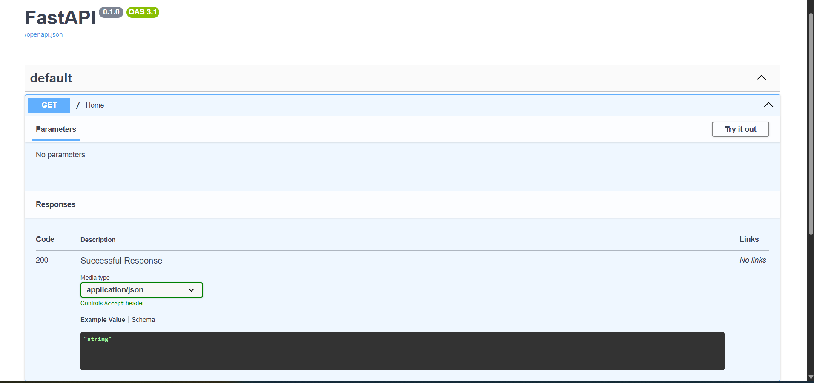
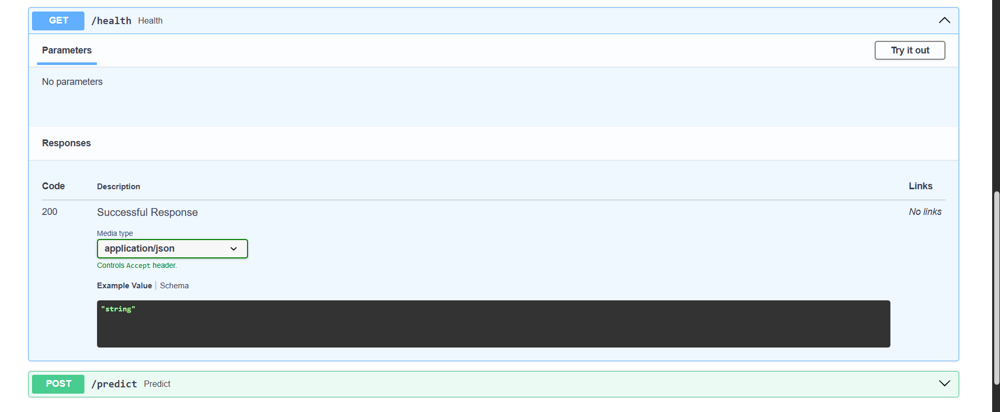
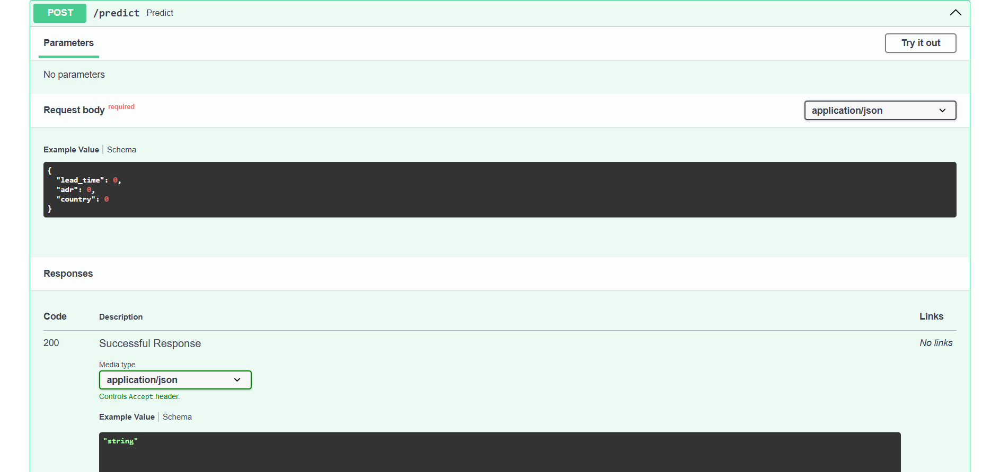

# 🏨 Hotel Booking Cancellation Prediction

A Machine Learning project that predicts whether a hotel booking will be cancelled, with an interactive Streamlit dashboard and a FastAPI REST API.

🔗 **Live App:** [https://hotel-booking-cancellation-prediction-ffyugdhduxby5bvxuuqje6.streamlit.app/](https://hotel-booking-cancellation-prediction-ffyugdhduxby5bvxuuqje6.streamlit.app/)

---

## 📌 Problem Statement

Hotels face significant revenue loss due to booking cancellations. This project builds an ML pipeline to predict whether a booking will be cancelled so that hotels can take proactive measures and improve booking management.

---

## 📊 Dataset Information

| Detail | Info |
|---|---|
| Dataset | Hotel Booking Demand Dataset |
| Original Records | 119,000+ |
| Records After Cleaning | 87,110 |
| Target Variable | `is_canceled` |
| Final Feature Count | 71 |

---

## 🧠 Machine Learning Pipeline

### 1. 🧹 Data Cleaning
- Handled missing values
- Removed duplicate records

### 2. ⚙️ Feature Engineering
- Label Encoded `Country` column
- One-Hot Encoded remaining categorical features
- Final Dataset Shape: 87,110 × 71

### 3. 🔀 Data Preprocessing
- Train-test split
- Prepared features for machine learning models

### 4. 🤖 Model Training
- Decision Tree Classifier
- K-Nearest Neighbors (KNN)
- Gaussian Naive Bayes
- LightGBM Classifier ✅ *(Best Model)*

### 5. 📊 Model Evaluation

| Metric | Score |
|---|---|
| Cross-Validation Accuracy | 84% |
| Tuned Accuracy | 85.2% |
| Hyperparameter Tuning | RandomizedSearchCV |

### 6. 🏆 Top Important Features

1. Lead Time
2. ADR (Average Daily Rate)
3. Country
4. Arrival Date Week Number
5. Arrival Date Day of Month
6. Agent
7. Stay Duration
8. Total Special Requests
9. Booking Changes

---

## 🖥️ Streamlit Application

Interactive dashboard for real-time hotel booking cancellation prediction.

> ## ## 📸 Streamlit Dashboard


🔗 **Live App:** [https://hotel-booking-cancellation-prediction-ffyugdhduxby5bvxuuqje6.streamlit.app/](https://hotel-booking-cancellation-prediction-ffyugdhduxby5bvxuuqje6.streamlit.app/)

---

## ⚡ FastAPI

REST API for serving model predictions programmatically, deployed on Render.

### API Endpoints

| Method | Endpoint | Description |
|---|---|---|
| GET | `/` | Home — project info |
| GET | `/health` | Model health check |
| POST | `/predict` | Predict booking cancellation |

## 📸 FastAPI

### Home


### Swagger UI


### Prediction API


🔗 **API:** [https://hotel-booking-cancellation-prediction-3mo1.onrender.com](https://hotel-booking-cancellation-prediction-3mo1.onrender.com)  
🔗 **Swagger Docs:** [https://hotel-booking-cancellation-prediction-3mo1.onrender.com/docs](https://hotel-booking-cancellation-prediction-3mo1.onrender.com/docs)

---

## 🐳 Docker

```bash
docker build -t hotel-booking-cancellation .
docker run -p 8501:8501 hotel-booking-cancellation
```

---

## 🔄 Project Workflow

```text
Data Cleaning
      ↓
Feature Engineering
      ↓
Data Preprocessing
      ↓
Model Training
      ↓
Model Evaluation
      ↓
Hyperparameter Tuning
      ↓
Streamlit Deployment
      ↓
FastAPI Development
      ↓
Docker Containerization
```

---

## 🛠️ Tech Stack

| Layer | Technology |
|---|---|
| Language | Python |
| ML | Scikit-learn, LightGBM |
| Data | Pandas, NumPy |
| Visualization | Matplotlib, Seaborn |
| Dashboard | Streamlit |
| API | FastAPI + Uvicorn |
| Container | Docker |
| Deployment | Streamlit Cloud, Render |
| Serialization | Joblib |

---

## 📂 Project Structure

```
Hotel_Booking_Cancellation_Prediction/
│
├── app.py                          # Streamlit dashboard
├── main.py                         # FastAPI backend
├── Dockerfile
├── requirements.txt
├── hotel_cancellation_model.pkl    # Trained LightGBM model
├── Hotel_Booking_Cancellation.ipynb
├── screenshots/
└── README.md
```

---

## 🚀 How to Run Locally

```bash
git clone https://github.com/souj05/Hotel-Booking-Cancellation-prediction.git
cd Hotel-Booking-Cancellation-prediction

pip install -r requirements.txt

# Streamlit
streamlit run app.py

# FastAPI
python -m uvicorn main:app --reload
```
